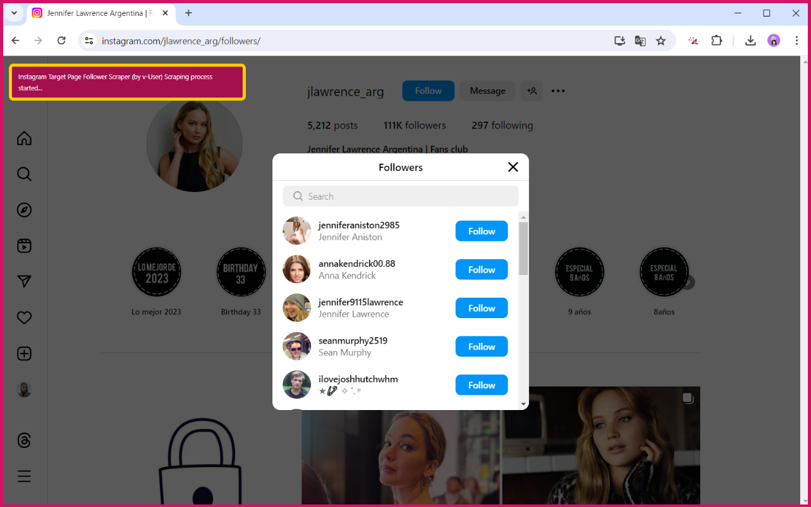
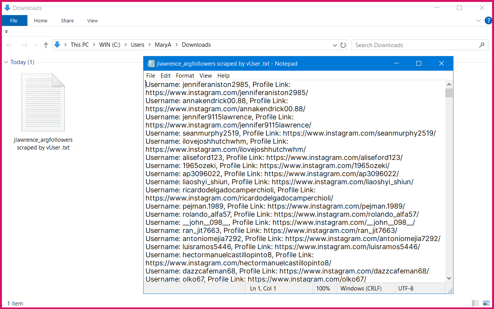

# Instagram Follower Extractor Extension

## Overview

This Chrome extension allows you to extract followers from any Instagram page. This tool is useful for social media managers, marketers, and anyone who wants to analyze Instagram follower data.

## Features
*   **Extracting followers' usernames and profile links**
*   **Exporting data in CSV format**
*   **Simple and user-friendly interface**
*   **Fast and efficient data extraction**

## Installation
1. Download the extension from [MehDAsaD/instagram-follower-scraper](https://github.com/MehDAsaD/instagram-follower-scraper/tree/main).
2. Open Chrome and go to "[chrome://extensions/](chrome://extensions/)".
3. Enable "Developer mode".
4. Click "Load unpacked" and select the extension folder.

## Screenshots
1. Click on the Instagram Follower Extractor extension icon to view the user interface in a pop-up. Click the "Click to Start Scraping" button to begin extraction.

   

2. You will see that the followers are being extracted.

   

3. The follower information is automatically saved in the Downloads folder on your system.

   

